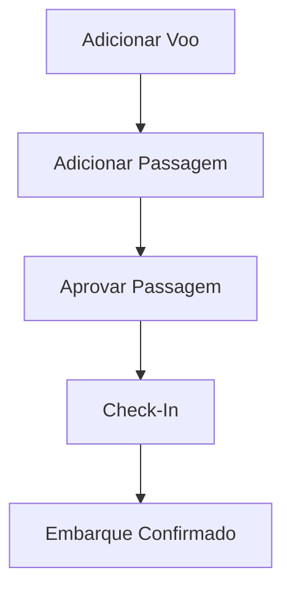
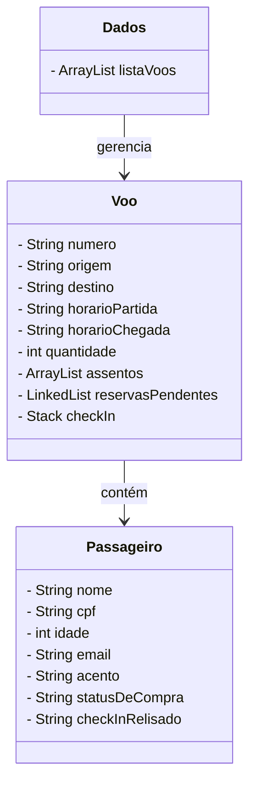

##  README — Sistema Aeroporto

### Descrição Geral

O **Sistema Aeroporto** é uma aplicação desenvolvida em **Java (Swing)** para gerenciar voos, passagens e processos de check-in em um ambiente de simulação de aeroporto.
O sistema permite o **cadastro de voos**, **emissão e aprovação de passagens**, além de **gerenciar o check-in** de passageiros em uma interface gráfica amigável.

---

## Estrutura do Projeto

```
com.aeroporto/
│
├── Dados/
│   ├── Colors.java
│   └── Dados.java
│
├── Passagens/
│   ├── Passageiro.java
│   ├── AdicionarPassagem.java
│   ├── AprovarPassagem.java
│   └── CheckIn.java
│
├── Voos/
│   ├── Voo.java
│   └── AdicionarVoo.java
│
├── PainelPrincipal.java
└── Heder.java
```

---

##  Tecnologias Utilizadas

* **Linguagem:** Java 17+
* **Interface gráfica:** Swing (`JFrame`, `JPanel`, `JButton`, `JLabel`, etc.)
* **Estruturas de dados:** `ArrayList`, `LinkedList`, `Stack`
* **IDE recomendada:** IntelliJ IDEA / VS Code / Eclipse
* **Gerenciamento:** PlatformIO / Maven / Manual (sem dependências externas)

---

## Entidades e Classes

### Classe `Voo` (`com.aeroporto.Voos.Voo`)

Responsável por representar os **voos cadastrados** no sistema e gerenciar o fluxo de assentos, reservas e check-ins.

#### Atributos Principais

| Atributo            | Tipo                     | Descrição                                                   |
| ------------------- | ------------------------ | ----------------------------------------------------------- |
| `numero`            | `String`                 | Identificador do voo                                        |
| `origem`            | `String`                 | Cidade de origem                                            |
| `destino`           | `String`                 | Cidade de destino                                           |
| `horarioPartida`    | `String`                 | Horário de partida                                          |
| `horarioChegada`    | `String`                 | Horário de chegada                                          |
| `quantidade`        | `int`                    | Quantidade total de assentos                                |
| `assentos`          | `ArrayList<String>`      | Estado de cada assento (“disponivel” ou nome do passageiro) |
| `reservasPendentes` | `LinkedList<Passageiro>` | Fila de reservas aguardando aprovação                       |
| `checkIn`           | `Stack<Passageiro>`      | Pilha de passageiros prontos para embarque                  |

#### 🔹 Estruturas de Dados

* **`ArrayList`**: permite acesso direto e controle fácil dos assentos.
* **`LinkedList`**: utilizada como uma **fila (FIFO)** para gerenciar reservas pendentes.
* **`Stack`**: funciona como uma **pilha (LIFO)** para controle de check-in, permitindo que o último aprovado seja o primeiro a realizar o embarque.

#### 🔹 Principais Métodos

* `addPassagensPendentes(Passageiro p)` — adiciona um passageiro à fila de reservas pendentes.
* `getCheckIn()` e `setCheckIn()` — manipulam a pilha de check-in.
* `getAssentos()` e `setAssentos()` — controlam o estado dos assentos.
* `toString()` — retorna os dados do voo em formato legível.

---

### Classe `Passageiro` (`com.aeroporto.Passagens.Passageiro`)

Representa os **passageiros** e suas informações pessoais e de voo.

#### 🔹 Atributos

| Atributo          | Tipo     | Descrição                                                    |
| ----------------- | -------- | ------------------------------------------------------------ |
| `voo`             | `Voo`    | Referência ao voo associado                                  |
| `nome`            | `String` | Nome do passageiro                                           |
| `cpf`             | `String` | CPF                                                          |
| `idade`           | `int`    | Idade                                                        |
| `email`           | `String` | Contato                                                      |
| `acento`          | `String` | Número do assento                                            |
| `statusDeCompra`  | `String` | Estado da passagem (“aguardando”, “confirmada”, “cancelada”) |
| `checkInRelisado` | `String` | Estado do check-in (“aguardando”, “confirmado”)              |

---

### Classe `Dados` (`com.aeroporto.Dados.Dados`)

Gerencia as **coleções principais** do sistema (lista de voos, consultas e relatórios).

#### 🔹 Funções

* `adicionarVoos(Voo voo)` — adiciona um novo voo à lista.
* `listarVoos()` — imprime e retorna todos os voos cadastrados.
* `listarVoosDisponivel()` — retorna a quantidade de voos disponíveis (não lotados).

---

### Classe `AdicionarVoo` (`com.aeroporto.Voos.AdicionarVoo`)

Interface gráfica para **cadastrar novos voos**.
Permite inserir número do voo, origem, destino, horários e quantidade de assentos.

* Mostra status de voos disponíveis e indisponíveis.
* Valida campos obrigatórios antes de salvar.
* Atualiza automaticamente a contagem de voos.

---

### Classe `AdicionarPassagem` (`com.aeroporto.Passagens.AdicionarPassagem`)

Interface responsável por **registrar passagens** em voos existentes.

* Lista voos disponíveis (`JComboBox`).
* Exibe visualmente os assentos disponíveis usando `JRadioButton`.
* Bloqueia seleção de assentos ocupados.
* Salva os passageiros nas **reservas pendentes** (`LinkedList` do voo).

---

### Classe `AprovarPassagem` (`com.aeroporto.Passagens.AprovarPassagem`)

Gerencia a **aprovação ou reprovação de passagens**.

* Exibe todas as reservas pendentes por voo.
* Ao aprovar uma passagem:

  * Move o passageiro da `LinkedList` para a `Stack` (`checkIn`).
  * Atualiza `statusDeCompra` para `"confirmada"`.
* Ao reprovar:

  * Define o status da compra como `"cancelada"`.
  * Exibe visualmente com cores (`verde`, `vermelho` e `cinza`).

---

### Classe `CheckIn` (`com.aeroporto.Passagens.CheckIn`)

Gerencia o **processo de embarque dos passageiros** com passagens aprovadas.

* Exibe os passageiros prontos para embarque (em `Stack`).
* Apenas o **passageiro no topo da pilha (peek)** pode realizar o check-in (controle de ordem LIFO).
* Ao clicar em “Aprovar”:

  * Remove o passageiro com `pop()`.
  * Atualiza `checkInRelisado` para `"confirmado"`.

---

## Fluxo de Funcionamento



1. **Administrador cadastra o voo.**
2. **Usuário reserva a passagem.**
3. **Admin aprova a compra.**
4. **Passageiro realiza check-in.**
5. **Sistema confirma embarque.**

---

## Diagrama de Classes (Simplificado)



---

##  Execução

### Pré-requisitos

* Java 17+
* IDE com suporte a Swing
* Projeto estruturado conforme os pacotes `com.aeroporto.*`

### Como Executar

1. Compile todas as classes.
2. Execute a classe principal `PainelPrincipal.java`.
3. Navegue pelos módulos:

   * “Adicionar Voo”
   * “Adicionar Passagem”
   * “Aprovar Passagem”
   * “Check-In”

---

## Cores e Estilo

A classe `Colors` centraliza as cores utilizadas na interface:

* Azul — fundo principal.
* Verde — sucesso (voo com assentos disponíveis).
* Laranja — alerta (voo quase cheio).
* Vermelho — erro ou lotado.
* Cinza — inativo ou neutro.

---

## Autor

**Desenvolvido por:** Ismailer Gregorio,Phablo,Cleber,Amanda Cesario
📂 Projeto acadêmico / educacional — Java Swing e estruturas de dados.
